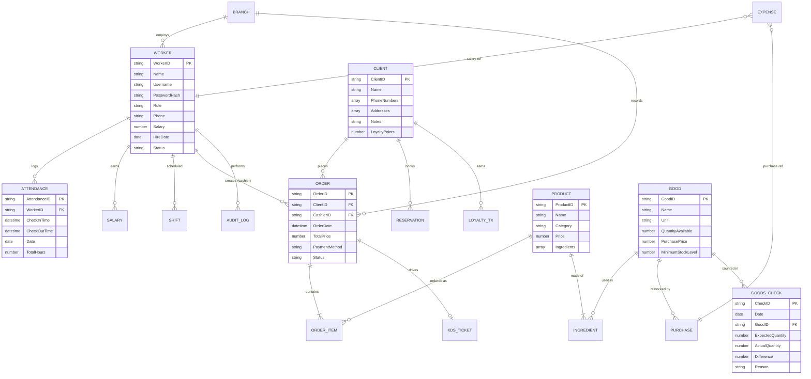
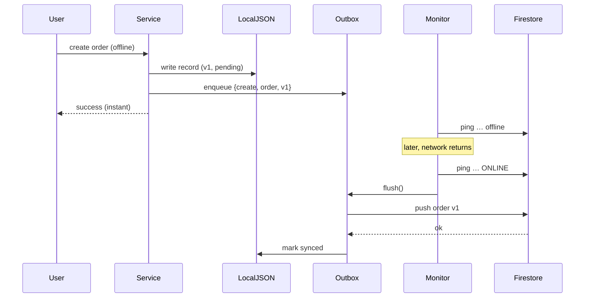
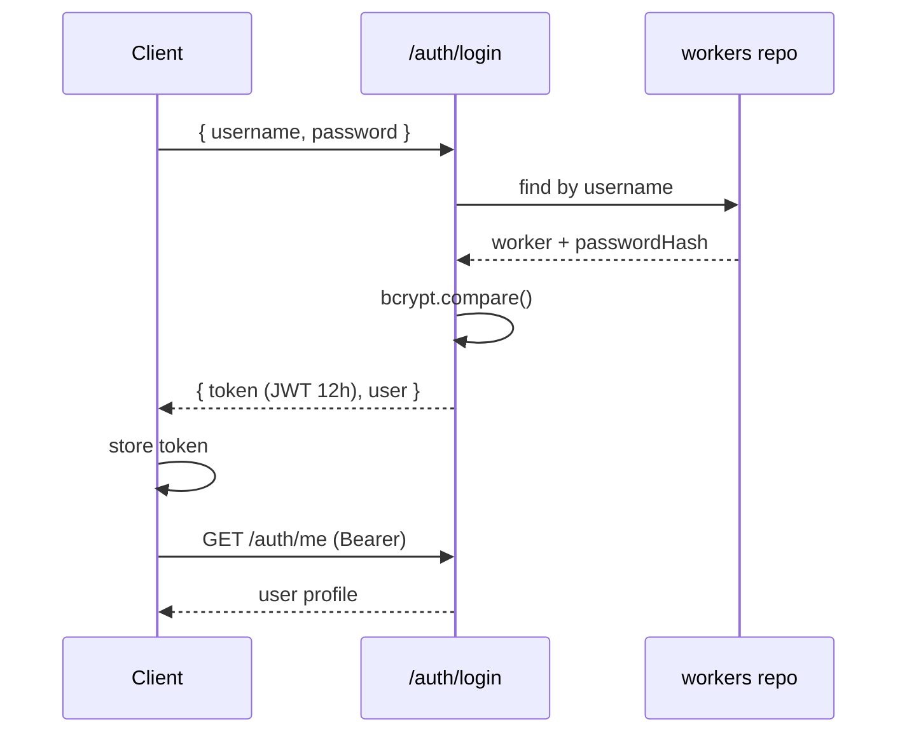
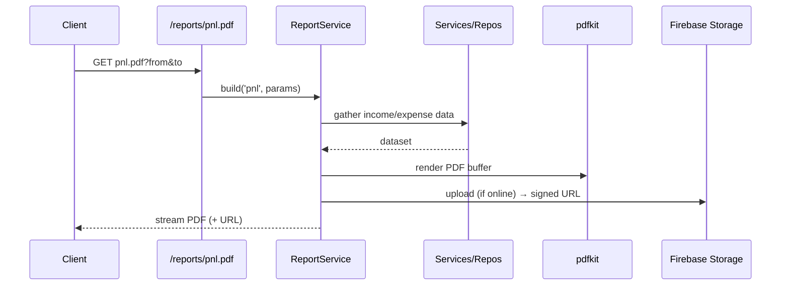
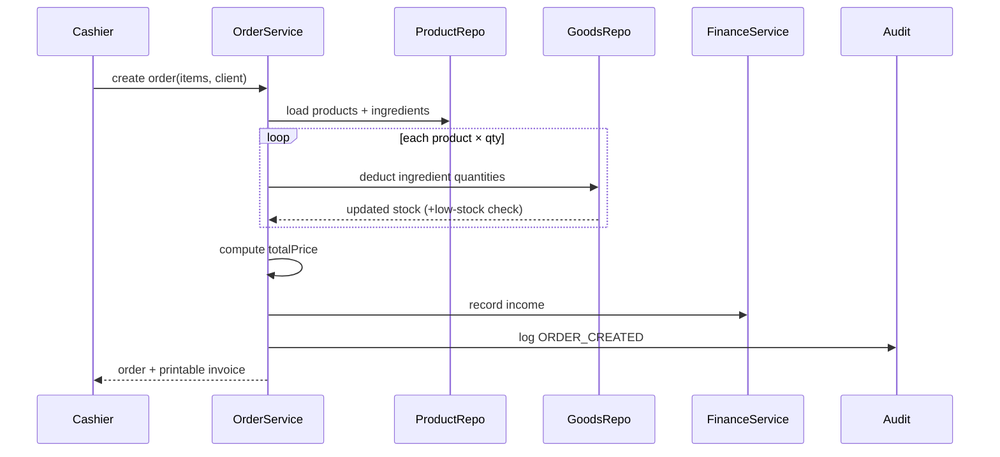
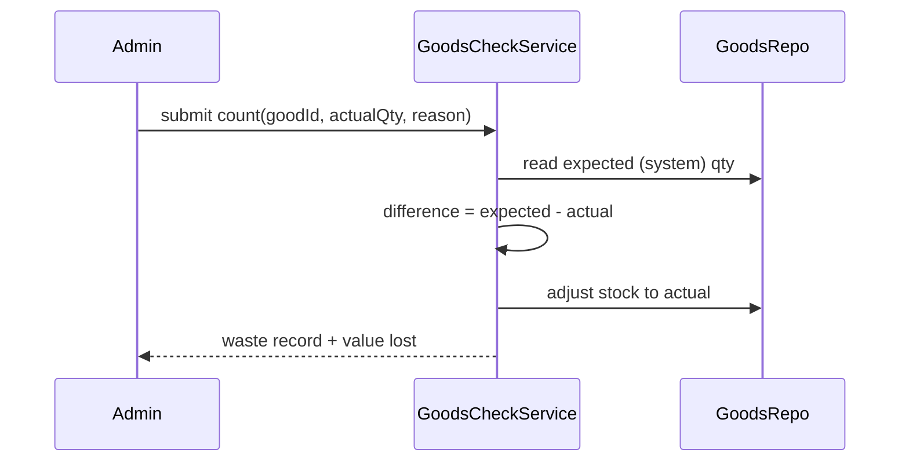

# 🍽️ Restaurant Management System — Full Implementation Plan

> **Status:** Architecture + runnable foundation delivered. This document is the master specification and roadmap. Every feature in the original request is mapped below — nothing is skipped.

**Stack:** React + Vite (+ Electron shell) · Node.js + Express · Firebase Firestore/Auth/Storage · Offline-first local JSON store · Arabic + English (RTL/LTR) · PDF & Excel reporting.

---

## Table of Contents
1. [Full System Architecture](#1-full-system-architecture)
2. [Database Schema](#2-database-schema)
3. [Firestore Collections](#3-firestore-collections)
4. [ER Diagram](#4-er-diagram)
5. [API Endpoints](#5-api-endpoints)
6. [React/Electron Folder Structure](#6-reactelectron-folder-structure)
7. [Node.js Backend Structure](#7-nodejs-backend-structure)
8. [Synchronization Mechanism](#8-synchronization-mechanism-offline-first)
9. [Authentication Flow](#9-authentication-flow)
10. [Role-Based Authorization](#10-role-based-authorization)
11. [Reporting & PDF Generation](#11-reporting--pdf-generation-architecture)
12. [Deployment Architecture](#12-deployment-architecture)
13. [Sequence Diagrams](#13-sequence-diagrams-for-critical-operations)
14. [Security Best Practices](#14-security-best-practices)
15. [Scalability Recommendations](#15-scalability-recommendations)
16. [Feature Coverage Matrix](#16-feature-coverage-matrix-nothing-skipped)
17. [Step-by-step Implementation Roadmap](#17-step-by-step-implementation-roadmap)

---

## 1. Full System Architecture

```
┌──────────────────────────────────────────────────────────────────────┐
│                         DESKTOP CLIENT (Electron)                       │
│  ┌────────────────────────────────────────────────────────────────┐   │
│  │                      React SPA (Vite)                            │   │
│  │  UI Layer:  Pages · Components · Design System (rounded, modern) │   │
│  │  State:     Zustand stores + React Query cache                   │   │
│  │  i18n:      Arabic (RTL) / English (LTR)                         │   │
│  │  Services:  API client (axios) · Auth · Offline cache            │   │
│  └───────────────────────────────┬────────────────────────────────┘   │
│                                   │ IPC (optional native: print/files)  │
│  ┌────────────────────────────────▼───────────────────────────────┐    │
│  │              Electron Main Process (desktop shell)              │    │
│  │   Native printing · File dialogs · Auto-update · Local window   │    │
│  └────────────────────────────────────────────────────────────────┘    │
└───────────────────────────────────┬──────────────────────────────────┘
                                     │ HTTP/REST (localhost or LAN)
┌────────────────────────────────────▼──────────────────────────────────┐
│                       NODE.JS BACKEND (Express)                         │
│  Routes → Controllers → Services → Repositories                        │
│  Middleware: Auth (JWT) · RBAC · Audit · Validation · Error handler    │
│  Cross-cutting: Reporting (PDF/Excel) · Import · Sync engine           │
│                                                                        │
│   ┌──────────────────────────┐        ┌──────────────────────────┐     │
│   │  Repository Pattern       │        │   Sync Engine            │     │
│   │  ┌────────────────────┐   │        │  - connectivity monitor  │     │
│   │  │ LocalJsonRepo (off)│◄──┼────────┤  - outbox queue          │     │
│   │  ├────────────────────┤   │ failover  - conflict resolution  │     │
│   │  │ FirestoreRepo (on) │   │        │  - mark synced           │     │
│   │  └────────────────────┘   │        └──────────────────────────┘     │
│   └───────────┬──────────────┘                                          │
└───────────────┼─────────────────────────────────┬──────────────────────┘
                │ when offline / fallback           │ when online
     ┌──────────▼───────────┐          ┌────────────▼─────────────┐
     │  Local JSON Store     │          │      FIREBASE             │
     │  backend/src/data/*.json│        │  Firestore (data)         │
     │  + outbox.json (queue) │         │  Auth (optional)          │
     └───────────────────────┘          │  Storage (reports/exports)│
                                         └──────────────────────────┘
```

**Key architectural decisions**
- **Offline-first by default.** The backend boots against a local JSON store seeded with mock data, so the system is fully usable with zero Firebase setup. Adding Firebase credentials to `.env` flips it into "online" mode and the sync engine flushes the outbox to Firestore.
- **Repository pattern** abstracts persistence: every service depends on an interface (`getAll`, `getById`, `create`, `update`, `remove`, `query`), never on Firestore directly. Swapping/adding a backend (e.g. Postgres) touches one folder.
- **Service layer** holds business rules (inventory deduction on order completion, cost/profit calc, attendance hours, loyalty points). Controllers stay thin.
- **Every write is wrapped by the audit + outbox** so nothing is lost and everything is traceable.

---

## 2. Database Schema

Logical schema (collection → fields). `*` = indexed, `↗` = reference to another collection.

| Collection | Fields |
|---|---|
| **workers** | `id*`, `name`, `username*`, `passwordHash`, `role` (admin\|cashier), `phone`, `salary`, `hireDate`, `status` (active\|inactive), `branchId↗`, `createdAt`, `updatedAt`, `_sync` |
| **attendance** | `id*`, `workerId↗*`, `checkInTime`, `checkOutTime`, `date*`, `totalHours`, `overtimeHours`, `branchId↗`, `_sync` |
| **clients** | `id*`, `name*`, `phoneNumbers[]*`, `addresses[]`, `notes`, `loyaltyPoints`, `totalSpent`, `visitCount`, `preferences[]`, `createdAt`, `_sync` |
| **goods** | `id*`, `name`, `unit`, `quantityAvailable`, `purchasePrice`, `minimumStockLevel`, `category`, `createdAt`, `_sync` |
| **products** | `id*`, `name`, `category*`, `price`, `ingredients[]` `{goodId↗, quantityRequired}`, `imageUrl`, `active`, `createdAt`, `_sync` |
| **orders** | `id*`, `clientId↗*`, `cashierId↗*`, `orderDate*`, `products[]` `{productId↗, quantity, unitPrice}`, `totalPrice`, `notes`, `paymentMethod`, `status`, `branchId↗`, `_sync` |
| **goodsChecks** | `id*`, `date*`, `goodId↗`, `expectedQuantity`, `actualQuantity`, `difference`, `reason`, `checkedBy↗`, `_sync` |
| **purchases** | `id*`, `goodId↗*`, `quantity`, `unitPrice`, `totalCost`, `supplier`, `date*`, `_sync` |
| **expenses** | `id*`, `type` (purchase\|salary\|misc), `amount`, `description`, `refId`, `date*`, `_sync` |
| **salaries** | `id*`, `workerId↗*`, `month*`, `baseSalary`, `overtimePay`, `deductions`, `netPay`, `paid`, `paidAt`, `_sync` |
| **reservations** | `id*`, `clientId↗`, `tableId`, `partySize`, `dateTime*`, `status` (booked\|seated\|completed\|no_show\|waitlist), `notes`, `_sync` |
| **kdsTickets** | `id*`, `orderId↗*`, `items[]`, `status` (new\|preparing\|ready\|served), `priority`, `startedAt`, `readyAt`, `_sync` |
| **shifts** | `id*`, `workerId↗*`, `start`, `end`, `role`, `date*`, `branchId↗`, `_sync` |
| **branches** | `id*`, `name`, `address`, `phone`, `active`, `createdAt`, `_sync` |
| **auditLogs** | `id*`, `userId↗*`, `action`, `entityType*`, `entityId`, `before`, `after`, `timestamp*` |
| **settings** | `id`, `restaurantName`, `currency`, `taxRate`, `language`, `theme`, `loyaltyRate`, ... |

`_sync` envelope present on every business record:
```jsonc
"_sync": {
  "status": "pending | synced | conflict",
  "version": 7,            // monotonic, for conflict resolution
  "updatedAt": 1719400000, // epoch ms, last-write-wins tiebreaker
  "deviceId": "pos-01",
  "deleted": false         // tombstone for soft-deletes
}
```

---

## 3. Firestore Collections

Firestore is schemaless but we enforce structure in the repository + validation layer.

```
firestore/
├── branches/{branchId}
├── workers/{workerId}
├── attendance/{attendanceId}          // queryable by workerId + date
├── clients/{clientId}
│     └── (denormalized: totalSpent, visitCount, loyaltyPoints)
├── goods/{goodId}
├── products/{productId}
├── orders/{orderId}
│     └── orderItems are embedded array (read-optimized)
├── goodsChecks/{checkId}
├── purchases/{purchaseId}
├── expenses/{expenseId}
├── salaries/{salaryId}
├── reservations/{reservationId}
├── kdsTickets/{ticketId}
├── shifts/{shiftId}
├── auditLogs/{logId}                   // append-only
└── settings/{singletonDoc}
```

**Composite indexes** (firestore.indexes.json): `orders(branchId asc, orderDate desc)`, `attendance(workerId asc, date desc)`, `auditLogs(entityType asc, timestamp desc)`, `goodsChecks(date desc)`.

**Security rules** (firestore.rules): authenticated reads, role-gated writes (admin full; cashier limited to orders/clients), audit logs append-only & immutable.

---

## 4. ER Diagram



---

## 5. API Endpoints

Base URL: `/api`. All protected by JWT except `/auth/login`. Role guard in brackets.

```
AUTH
  POST   /auth/login                      → { token, user }
  POST   /auth/logout                     [auth]
  GET    /auth/me                         [auth]

WORKERS                                    [admin]
  GET    /workers            POST   /workers
  GET    /workers/:id        PUT    /workers/:id
  PATCH  /workers/:id/disable DELETE /workers/:id
  GET    /workers/:id/activity

ATTENDANCE
  POST   /attendance/clock-in             [auth]
  POST   /attendance/clock-out            [auth]
  GET    /attendance                      [admin]  ?workerId&from&to
  GET    /attendance/reports/monthly      [admin]

CLIENTS
  GET    /clients            POST   /clients         [auth]
  GET    /clients/:id        PUT    /clients/:id      [auth]
  GET    /clients/search?phone=&name=                 [auth]
  GET    /clients/:id/history                         [auth]
  POST   /clients/:id/phones POST   /clients/:id/addresses [auth]

PRODUCTS                                   [admin write, auth read]
  GET /products  POST /products  GET /products/:id  PUT /products/:id  DELETE /products/:id
  GET /products/:id/cost                  → { cost, price, profit, margin }

GOODS (inventory)                          [admin write, auth read]
  GET /goods  POST /goods  GET /goods/:id  PUT /goods/:id  DELETE /goods/:id
  POST /goods/:id/purchase                → restock + expense
  GET  /goods/alerts/low-stock

GOODS-CHECK / WASTE                        [admin]
  GET /goods-checks  POST /goods-checks
  GET /goods-checks/reports/waste?from&to

ORDERS
  GET /orders   POST /orders              [auth]
  GET /orders/:id  PUT /orders/:id
  PATCH /orders/:id/cancel                [auth]
  PATCH /orders/:id/status                [auth]
  GET /orders/:id/invoice.pdf             [auth]

FINANCE                                    [admin]
  GET /finance/income?period=daily|weekly|monthly|annual
  GET /finance/expenses     GET /finance/profit
  GET /finance/cashflow     POST /expenses

ANALYTICS                                  [admin]
  GET /analytics/dashboard                → all KPI blocks
  GET /analytics/sales      GET /analytics/inventory
  GET /analytics/workers    GET /analytics/customers

REPORTS (PDF/Excel)                        [admin]
  GET /reports/:type.pdf                   ?from&to&...
  GET /reports/:type.xlsx
  // types: attendance, income, expenses, pnl, stock, low-stock,
  //        waste, consumption, product-performance, sales-trends,
  //        order-history, customer-spending, customer-activity,
  //        salary, worker-performance

IMPORT
  POST /import/:entity (xlsx)             [admin]  // products|goods|clients|workers
  POST /import/:entity/validate          [admin]

RESERVATIONS                               [auth]
  GET /reservations  POST /reservations  PUT /reservations/:id
  PATCH /reservations/:id/no-show   GET /reservations/calendar

KDS                                        [auth]
  GET /kds/tickets   PATCH /kds/tickets/:id/status

LOYALTY                                    [auth]
  GET /loyalty/:clientId   POST /loyalty/:clientId/redeem

SCHEDULING                                 [admin]
  GET /shifts  POST /shifts  PUT /shifts/:id  GET /shifts/forecast

BRANCHES                                   [admin]
  GET /branches  POST /branches  GET /branches/compare

AUDIT                                      [admin]
  GET /audit-logs   ?userId&entityType&from&to

SETTINGS                                   [admin]
  GET /settings   PUT /settings

SYNC
  GET /sync/status   POST /sync/flush     [admin]
```

---

## 6. React/Electron Folder Structure

```
frontend/
├── electron/
│   ├── main.js               # Electron main process (window, print, file dialogs)
│   └── preload.js            # secure IPC bridge
├── public/
├── src/
│   ├── main.jsx              # React entry
│   ├── App.jsx               # router + providers
│   ├── api/                  # axios client + per-module API modules
│   │   ├── client.js
│   │   └── endpoints.js
│   ├── store/                # Zustand stores (auth, ui, offline)
│   ├── i18n/                 # ar.json, en.json, index.js (RTL switch)
│   ├── layout/               # AppShell, Sidebar, Topbar
│   ├── components/           # design-system: Button, Card, Table, Modal, Stat…
│   ├── pages/                # one folder per module
│   │   ├── Login/  Dashboard/  Workers/  Attendance/  Clients/
│   │   ├── Products/  Inventory/  GoodsCheck/  Orders/  Finance/
│   │   ├── Reports/  Reservations/  Kitchen/  Loyalty/  Scheduling/
│   │   ├── Branches/  AuditLogs/  Settings/
│   ├── hooks/                # useAuth, useApi, useOnlineStatus…
│   ├── styles/               # tokens.css (rounded design system), globals.css
│   └── utils/                # formatters, currency, dates
├── index.html
├── vite.config.js
└── package.json
```

**Electron packaging:** `electron-builder` produces Windows `.exe` / macOS `.dmg` / Linux `.AppImage`. Dev runs Vite dev server; production loads the built `dist/`.

---

## 7. Node.js Backend Structure

```
backend/
├── src/
│   ├── server.js             # Express bootstrap, middleware chain, route mount
│   ├── config/
│   │   ├── index.js          # env loading, online/offline flag
│   │   └── firebase.js       # Firebase Admin init (lazy, optional)
│   ├── models/               # schema definitions + validators (one per entity)
│   ├── repositories/
│   │   ├── BaseRepository.js
│   │   ├── LocalJsonRepository.js   # offline store
│   │   ├── FirestoreRepository.js   # online store
│   │   └── index.js          # factory: picks impl per connectivity
│   ├── services/             # business logic per module
│   ├── controllers/          # thin HTTP handlers
│   ├── routes/               # express routers, mounted in server.js
│   ├── middleware/           # auth, rbac, audit, validate, errorHandler
│   ├── sync/
│   │   ├── connectivity.js   # online/offline monitor
│   │   ├── outbox.js         # pending-change queue
│   │   └── syncEngine.js     # flush + conflict resolution
│   ├── utils/                # pdf, excel, hash, logger, ids
│   ├── data/                 # local JSON store (generated/seeded)
│   └── seed/                 # mock data generators
├── .env.example
└── package.json
```

---

## 8. Synchronization Mechanism (Offline-First)

**Goal:** every operation works offline; no data loss; safe conflict resolution on reconnect.

1. **Write path.** Service → Repository. The repository *always* writes to the local JSON store first (instant, durable) and appends an entry to `outbox.json` with `{op, collection, id, payload, version, timestamp, deviceId}`. The user never waits on the network.
2. **Connectivity monitor** (`sync/connectivity.js`) pings Firestore / a health endpoint every N seconds and exposes `isOnline`.
3. **Flush.** When `isOnline` flips true (or every interval while online), `syncEngine.flush()` drains the outbox in order:
   - For each entry, fetch the remote `version`.
   - **No remote / remote.version < local.version** → push (last-writer by version wins).
   - **remote.version > local.version** → **conflict**: apply resolution policy.
4. **Conflict resolution policy** (configurable):
   - Default **Last-Write-Wins** by `_sync.updatedAt` (epoch ms).
   - **Field-merge** for additive collections (e.g. client `phoneNumbers[]`, `addresses[]`, loyalty points) — union instead of overwrite.
   - **Tombstones** for deletes (`_sync.deleted=true`) so a delete is never resurrected.
   - Unresolved conflicts are flagged `_sync.status="conflict"` and surfaced in the admin **Sync** screen for manual choice.
5. **Mark synced.** On success the local record's `_sync.status` becomes `"synced"` and the outbox entry is removed.
6. **Pull.** On reconnect the engine also pulls remote changes newer than the local `lastPulledAt` watermark and merges them locally.



---

## 9. Authentication Flow

- **Local/offline auth (default):** username + bcrypt-hashed password in `workers`. `POST /auth/login` verifies and returns a **JWT** (`{sub, role, name}`, signed with `JWT_SECRET`, 12h expiry). Frontend stores it (memory + secure storage) and sends `Authorization: Bearer`.
- **Firebase Auth (optional, when configured):** the same endpoint can verify a Firebase ID token via Admin SDK and map the UID → worker record/role.
- **Middleware** `auth` validates the token, attaches `req.user`. `me` returns the current profile.



---

## 10. Role-Based Authorization

- Roles: **admin** (everything), **cashier** (orders, clients, inventory read, own activity).
- `rbac(...allowedRoles)` middleware guards each route. A central **permission matrix** (`config/permissions.js`) maps `role → allowed actions`, also consumed by the frontend to hide/disable UI.
- Cashier hard-blocks: settings, worker management, finance/salary admin → return `403`.

| Capability | Admin | Cashier |
|---|:--:|:--:|
| Orders create/print | ✅ | ✅ |
| Clients add/edit/search | ✅ | ✅ |
| Inventory view | ✅ | ✅ |
| Inventory edit / purchase | ✅ | ❌ |
| Workers / salaries / attendance admin | ✅ | ❌ |
| Finance / analytics / reports | ✅ | ❌ |
| Settings / branches / audit | ✅ | ❌ |
| Own activity | ✅ | ✅ |

---

## 11. Reporting & PDF Generation Architecture

- **PDF**: `pdfkit` (server-side) renders branded reports → streamed to client and/or uploaded to **Firebase Storage** (when online) with a signed URL stored on the report record.
- **Excel**: `exceljs` builds `.xlsx` with typed columns, totals, and formatting.
- **Report pipeline:** `ReportService.build(type, params)` → pulls data via services → `pdf/excel` renderer → returns buffer. One renderer registry keeps every report consistent (header with restaurant name/logo, period, generated-at, RTL/LTR aware).
- **Coverage (every report in the spec):** attendance (per-employee, hours, overtime), finance (daily/monthly income, expenses, P&L, cash flow), inventory (current stock, low stock, waste, consumption), sales (product performance, trends, order history), customer (spending, activity), worker (salary, performance). All exportable as **PDF + Excel**, all printable.



---

## 12. Deployment Architecture

- **Desktop (primary):** Electron app bundles the React build; the Node backend runs either embedded (child process) or as a small local service on `localhost:4000`. `electron-builder` → signed installers + auto-update feed.
- **Backend hosting (optional central server for multi-branch):** containerize Express (Docker) → Cloud Run / Render / a VPS. Firestore is managed by Firebase. Storage by Firebase Storage.
- **Environments:** `dev` (local JSON, mock data), `staging` (Firebase test project), `prod` (Firebase prod project). All Firebase keys come from `.env`.
- **CI/CD:** lint + test on push → build installers (matrix: win/mac/linux) → publish release.

---

## 13. Sequence Diagrams for Critical Operations

**Create order + auto inventory deduction**


**Clock-in / Clock-out**
```mermaid
sequenceDiagram
    participant W as Worker
    participant A as AttendanceService
    W->>A: clock-in
    A->>A: open record (checkIn=now)
    W->>A: clock-out
    A->>A: checkOut=now; totalHours; overtime = max(0, hours-8)
    A-->>W: summary
```

**Physical goods check → waste**


---

## 14. Security Best Practices

- **Passwords:** bcrypt (cost 10+), never stored/returned in plaintext; `passwordHash` stripped from all API responses.
- **JWT:** short-lived, signed with strong `JWT_SECRET`; role embedded; verified on every request.
- **Transport:** HTTPS in production; `helmet` security headers; CORS allow-list.
- **Input validation:** every write validated (schema in `models/`) before persistence; reject unknown fields.
- **RBAC** enforced server-side (never trust the client); cashier endpoints scoped to self where relevant.
- **Audit logs** are append-only and immutable (Firestore rules forbid update/delete).
- **Firestore security rules** gate reads/writes by auth + role; Storage rules scope report access.
- **Secrets** only in `.env` (git-ignored). `.env.example` documents required keys with no real values.
- **Rate limiting** on `/auth/login`; lockout after repeated failures.
- **Least privilege** service account for Firebase Admin.

---

## 15. Scalability Recommendations

- **Stateless backend** → horizontal scale behind a load balancer; JWT means no server session affinity.
- **Firestore** scales automatically; design for it: shallow queries, composite indexes, denormalized counters (`client.totalSpent`, `client.visitCount`) updated transactionally.
- **Pagination & cursors** on all list endpoints; never load full collections.
- **Caching:** React Query on the client; optional Redis for hot analytics aggregates.
- **Background jobs** for heavy reports/aggregations (queue → worker) so requests stay fast.
- **Multi-branch:** `branchId` partition key on every record enables per-branch sharding and centralized roll-ups.
- **Read models / materialized aggregates** for dashboards (precompute daily sales) instead of scanning orders live.
- **Observability:** structured logging, request tracing, error monitoring (Sentry).

---

## 16. Feature Coverage Matrix (nothing skipped)

| # | Feature (from spec) | Where it lives |
|--|--|--|
| 1 | Worker Management (CRUD, disable, salary, activity) | `workerService`, `/workers`, Workers page |
| 2 | Attendance (clock in/out, hours, overtime, reports) | `attendanceService`, `/attendance`, Attendance page |
| 3 | Client CRM (multi phone/address, search, history) | `clientService`, `/clients`, Clients page |
| 4 | Product Management (CRUD, cost, profit, ingredients) | `productService`, `/products`, Products page |
| 5 | Inventory (goods CRUD, purchases, alerts, valuation) | `goodsService`, `/goods`, Inventory page |
| 6 | Goods Check / Waste (counts, loss, adjust, reports) | `goodsCheckService`, `/goods-checks`, GoodsCheck page |
| 7 | Orders (CRUD, cancel, invoice, auto-deduct) | `orderService`, `/orders`, Orders page (POS) |
| 8 | Financial (income, expenses, P&L, cash flow) | `financeService`, `/finance`, Finance page |
| 9 | Analytics Dashboard (sales/finance/inventory/worker/customer) | `analyticsService`, `/analytics`, Dashboard |
| 10 | Reporting (PDF+Excel+print, all report types) | `reportService`, `utils/pdf,excel`, `/reports`, Reports page |
| 11 | Bulk Import (manual + Excel, validation) | `importService`, `/import`, import dialogs |
| 12 | Audit Logs (every op, admin view) | `audit` middleware, `/audit-logs`, AuditLogs page |
| 13 | Reservation Management (tables, waitlist, calendar, no-show) | `reservationService`, `/reservations`, Reservations page |
| 14 | Kitchen Display System (live, timers, priority, ready) | `kdsService`, `/kds`, Kitchen page |
| 15 | Multi-Branch (entity, central reporting, comparison) | `branchService`, `/branches`, Branches page |
| 16 | Employee Scheduling (shifts, planning, forecast) | `shiftService`, `/shifts`, Scheduling page |
| 17 | Customer Loyalty (points, rewards, visits, preferences) | `loyaltyService`, `/loyalty`, Loyalty page |
| 18 | Offline Support (local JSON, sync, conflict, no loss) | `repositories/`, `sync/`, Sync screen |
| 19 | Auth + RBAC (admin/cashier) | `auth`+`rbac` middleware, Login, permission matrix |
| 20 | Arabic + English (RTL/LTR) | `i18n/`, direction switch |
| 21 | Modern rounded UI | `styles/tokens.css` design system |

---

## 17. Step-by-step Implementation Roadmap

**Phase 0 — Foundation (this delivery)**
- [x] Monorepo structure, plan, design system, env scaffolding.
- [x] Backend: config, repository pattern (local JSON + Firestore), offline sync skeleton.
- [x] Backend: models + services + routes for all modules.
- [x] Mock data seeder (workers, clients, products, goods, orders, attendance, …).
- [x] Frontend: shell, i18n (AR/EN), auth, dashboard, core module pages bound to mock data.

**Phase 1 — Core operations**
- [ ] Harden Orders (POS) flow + inventory deduction transactions.
- [ ] Attendance clock in/out + overtime rules.
- [ ] Client CRM search/history; product cost/profit.
- [ ] Receipt/invoice PDF + thermal print layout.

**Phase 2 — Finance, analytics, reporting**
- [ ] Finance aggregates (income/expense/P&L/cash flow).
- [ ] Dashboard KPIs + charts.
- [ ] Full PDF + Excel report suite.

**Phase 3 — Inventory depth**
- [ ] Purchases, low-stock alerts, valuation.
- [ ] Goods check / waste analytics.
- [ ] Excel bulk import + validation.

**Phase 4 — Advanced modules**
- [ ] Reservations + waitlist + calendar + no-show.
- [ ] Kitchen Display System (live tickets, timers).
- [ ] Loyalty program; employee scheduling + forecast.

**Phase 5 — Sync, multi-branch, hardening**
- [ ] Robust conflict resolution + Sync admin screen.
- [ ] Multi-branch partitioning + comparison reports.
- [ ] Security hardening, audit completeness, rate limiting.

**Phase 6 — Desktop & release**
- [ ] Electron packaging, native print, auto-update.
- [ ] CI/CD installers; Firebase prod project; docs.

---

### How the pieces connect (quick mental model)
> A **Cashier** opens the desktop app → logs in (JWT) → creates an **Order** on the POS page. The `OrderService` deducts **Goods** per the **Product** recipe, records **income** in Finance, writes an **audit log**, and (if the kitchen is on) pushes a **KDS ticket**. Everything is written to the **local JSON store** first and queued in the **outbox**; the moment internet returns, the **sync engine** flushes it to **Firestore** and resolves conflicts. The **Admin** sees it all on the **Dashboard**, and exports **PDF/Excel** reports. Loyalty points accrue to the **Client**; reservations, scheduling, and multi-branch round out operations.
